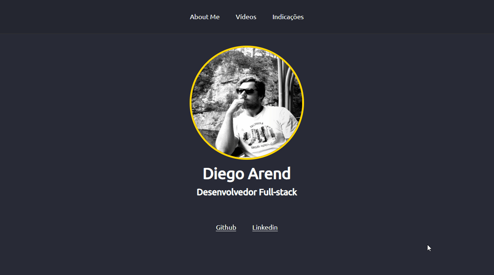

# AboutMeSimpleVersion

Um about me simples para conhecer melhor o nunjucks com base no material da Rocketseat. 

Para executar basta clonar ou fazer o downlaod do diretório e no terminal executar:

npm start

   

